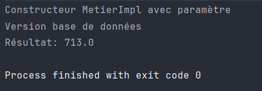
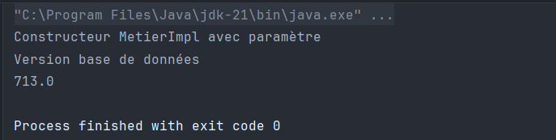
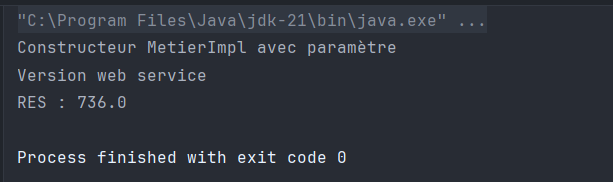
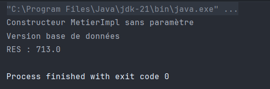

# Démonstration d'Injection de Dépendances

Ce projet démontre différentes méthodes d'injection de dépendances en Java, depuis le câblage manuel de base jusqu'à l'utilisation du Framework Spring.

## Structure du Projet

Le projet est organisé en plusieurs packages:
- `dao`: Contient l'interface d'accès aux données et son implémentation
- `ext`: Contient une implémentation alternative de l'interface d'accès aux données
- `metier`: Contient l'interface de logique métier et son implémentation
- `presentation`: Contient différentes classes démontrant diverses méthodes d'injection de dépendances

## Implémentation Étape par Étape

### 1. Création des Interfaces

#### 1.1 Interface IDao

L'interface `IDao` définit une méthode simple pour récupérer des données:

```java
public interface IDao {
    double getData();
}
```

#### 1.2 Interface IMetier

L'interface `IMetier` définit une méthode métier qui utilisera la couche d'accès aux données:

```java
public interface IMetier {
    double calcul();
}
```

### 2. Implémentation des Interfaces

#### 2.1 Classe DaoImpl

La classe `DaoImpl` implémente l'interface `IDao` et est annotée avec `@Repository` pour Spring:

```java
@Repository("dao")
public class DaoImpl implements IDao {
    @Override
    public double getData() {
        System.out.println("Version base de données");
        double temp = 31;
        return temp;
    }
}
```

#### 2.2 Classe DaoImplV2

Une implémentation alternative de `IDao` dans le package `ext`:

```java
@Component("dao2")
public class DaoImplV2 implements IDao {
    @Override
    public double getData() {
        System.out.println("Version web service");
        double temp = 32;
        return temp;
    }
}
```

#### 2.3 Classe MetierImpl

La classe `MetierImpl` implémente l'interface `IMetier` et dépend d'une implémentation de `IDao`:

```java
@Service("metier")
public class MetierImpl implements IMetier {
    @Autowired
    private IDao dao;

    public MetierImpl() {
        System.out.println("Constructeur MetierImpl sans paramètre");
    }

    public MetierImpl(@Qualifier("dao") IDao dao) {
        this.dao = dao;
        System.out.println("Constructeur MetierImpl avec paramètre");
    }

    @Override
    public double calcul() {
        double t = dao.getData();
        double res = t * 23;
        return res;
    }

    public void setDao(IDao dao) {
        this.dao = dao;
    }
}
```

### 3. Méthodes d'Injection de Dépendances

#### 3.1 Instanciation Statique (PresentationV1)

Cette méthode crée et connecte manuellement les objets:

```java
public static void main(String[] args) {
    DaoImpl dao = new DaoImpl();
    MetierImpl metier = new MetierImpl(dao); // Injection via constructeur
    // metier.setDao(dao); // Alternative: Injection via setter
    double res = metier.calcul();
    System.out.println("Résultat: " + res);
}
```

La sortie de l'exécution de PresentationV1:


#### 3.2 Instanciation Dynamique (PresentationV2)

Cette méthode utilise la réflexion pour créer des objets basés sur des noms de classes dans un fichier de configuration:

```java
public static void main(String[] args) {
    try {
        Scanner scanner = new Scanner(new File("config.txt"));

        String daoClassName = scanner.nextLine();
        Class daoClass = Class.forName(daoClassName);
        IDao dao = (IDao) daoClass.getConstructor().newInstance();

        String metierClassName = scanner.nextLine();
        Class metierClass = Class.forName(metierClassName);
        IMetier metier = (IMetier) metierClass.getConstructor(IDao.class).newInstance(dao);

        Method setDao = metierClass.getDeclaredMethod("setDao", IDao.class);
        setDao.invoke(metier, dao);

        System.out.println(metier.calcul());
    } catch (Exception e) {
        throw new RuntimeException(e);
    }
}
```

Le fichier `config.txt` contient:
```
dao.DaoImpl
metier.MetierImpl
```

La sortie de l'exécution de PresentationV2:


#### 3.3 Framework Spring - Configuration XML (PresentationSpringXML)

Cette méthode utilise la configuration basée sur XML de Spring:

```java
public static void main(String[] args) {
    ApplicationContext context = new ClassPathXmlApplicationContext("applicationContext.xml");
    IMetier metier = context.getBean(IMetier.class);
    System.out.println("RES : " + metier.calcul());
}
```

Le fichier `applicationContext.xml` contient:
```xml
<beans>
    <bean id="d" class="ext.DaoImplV2"></bean>
    <bean id="metier" class="metier.MetierImpl">
        <!-- Injection via constructeur -->
        <constructor-arg ref="d"></constructor-arg>

        <!-- Alternative: Injection via setter -->
        <!--<property name="dao" ref="d"></property>-->
    </bean>
</beans>
```

La sortie de l'exécution de PresentationSpringXML:


#### 3.4 Framework Spring - Configuration par Annotations (PresentationSpringAnnotation)

Cette méthode utilise la configuration basée sur les annotations de Spring:

```java
public static void main(String[] args) {
    ApplicationContext context = new AnnotationConfigApplicationContext("dao", "metier");
    IMetier metier = context.getBean(IMetier.class);
    System.out.println("RES : " + metier.calcul());
}
```

Les classes sont annotées avec les annotations Spring:
- `@Repository` pour les classes DAO
- `@Service` pour les classes de service
- `@Component` pour les composants généraux
- `@Autowired` pour l'injection de dépendances
- `@Qualifier` pour spécifier quelle implémentation injecter

La sortie de l'exécution de PresentationSpringAnnotation:


## Conclusion

Ce projet démontre différentes approches d'injection de dépendances:

1. **Instanciation Statique**: Simple mais fortement couplée
2. **Instanciation Dynamique**: Plus flexible mais nécessite plus de code
3. **Configuration XML Spring**: Découple la configuration du code
4. **Configuration par Annotations Spring**: Simplifie la configuration avec des annotations

L'injection de dépendances aide à créer des applications faiblement couplées, maintenables et testables en séparant la responsabilité de création des objets de leur utilisation.
